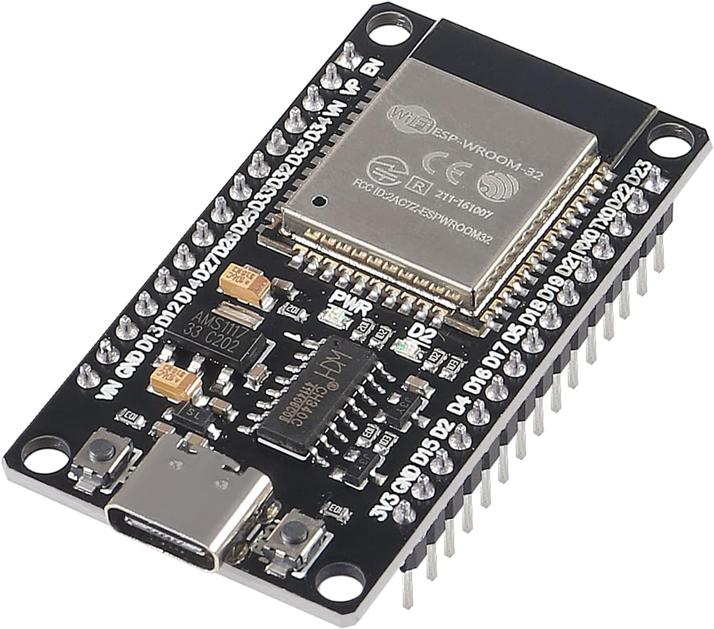

# Minimum Setup
I would at least reccommend an ESP8266 flashed with tasmota. I use a ESP32 myself because it offers much more I/O, is way faster, has an USB-C connection and is absolutely worth the price!

flashed with tasmota32 (custom build that includes the MLX90614 library)

