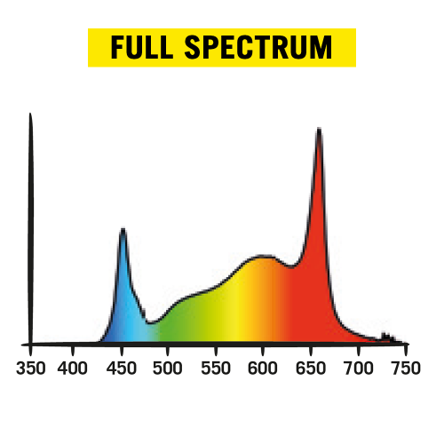

# Growlights
The growlights are all LEDs and use 24VDC (except the cutlings light which is 230V).
Keep in mind that there is a difference between growth and bloom lights - the growth lights are more blueish and the bloom lights are more reddish.

## 60x60x160 area (main chamber)
This is the left area - the main area (basically a DS60 tent)

- 40W IR + 40W UV supplement (2x [COL20IR + COL20UV](https://www.secretjardin.com/de/cosmorrow-boosters-ir-uv/))
 (note: UV may be a bit over dimensioned for 60x60 but we'll see)
### When in flowering period
- 100W (5x 20W) Cosmorrow Bloom Kit ([COM100FS](https://www.secretjardin.com/de/intensive-blooming/))
  
### When in vegetative period
- 3x 20W Cosmorrow Grow Kit ([TNO40GR](https://www.secretjardin.com/de/intermediate-growing/))
  
## 60x40x100 area (mother plant)
- 2x / 3x 20W Cosmorrow Grow ([COP2065](https://www.secretjardin.com/de/bulbs-power-supplies/))
- 20W Infrared ([COL20IR](https://www.secretjardin.com/de/cosmorrow-boosters-ir-uv/))
  
## 60x40x60 area (aeroponic cloner)
- Factory TLED V2.0 26W 6500K Growth ([link](https://www.led-grower.eu/pure-factory-tled-v2-0-26w-6500k-growth/))