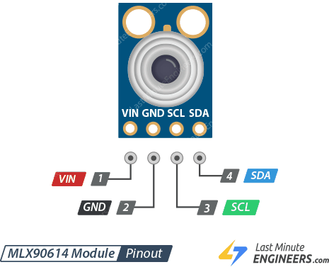
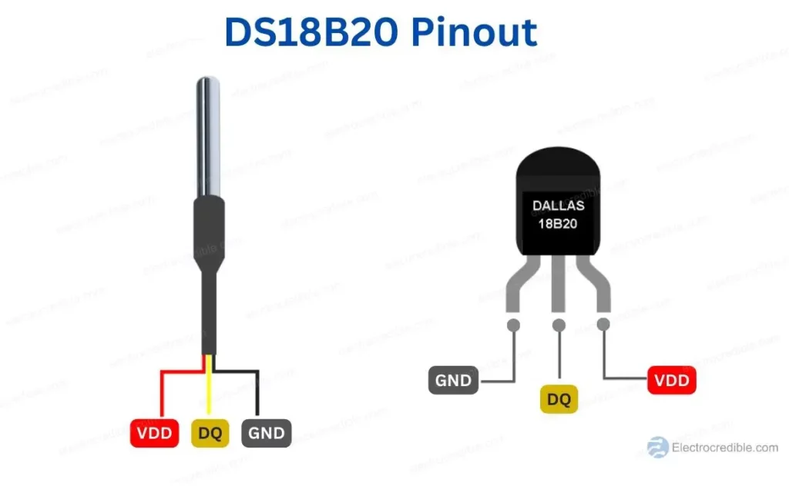
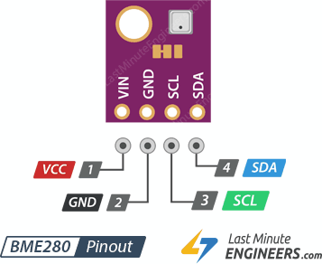
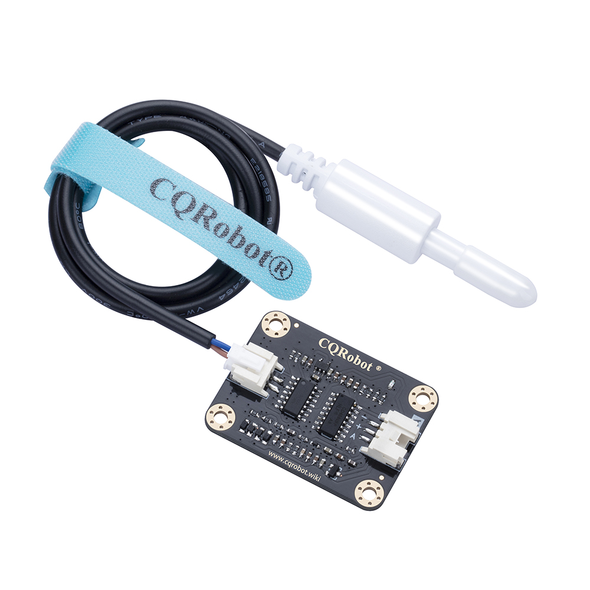

# Sensors

## Temperature Sensors
- [MLX90614](https://components101.com/sensors/melexis-mlx90614-contact-less-ir-temperature-sensor): infrared leaf temperature for VPD calculation (I2C), see [Tasmota documentation for MLX90614](https://tasmota.github.io/docs/MLX90614/). <b>Warning: you need to compile the binary of Tasmota yourself because it doesn't include this feature in the default binaries.</b>

- 3x [DS18B20](https://www.analog.com/media/en/technical-documentation/data-sheets/ds18b20.pdf): for water temperature (analog Sensor), look at [Tasmota documentation](https://tasmota.github.io/docs/DS18x20/#multiple-sensors) for more infos and how to connect multiple sensors to one GPIO pin.
  
## Temperature/Humidity Sensors
- 2x [BME280](https://www.mouser.at/ProductDetail/Bosch-Sensortec/BME280?qs=2OnyuXx6vpj2fK9HX7qb3g%3D%3D): temp, humidity and barometric pressure (I2C), see [Tasmota documentation for BME280](https://tasmota.github.io/docs/BME280/).
  
## TDS/EC Sensor
- [QCRobot TDS meter sensor](https://www.cqrobot.com/index.php?route=product/product&product_id=1122), see [Tamota documentation for Analog Pins](https://tasmota.github.io/docs/ADC/).
