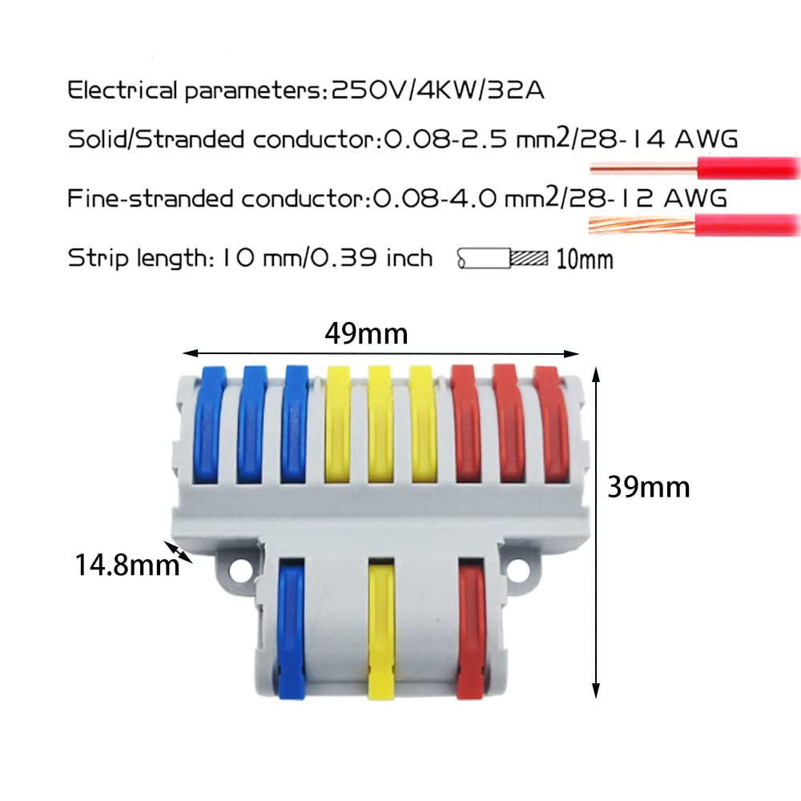
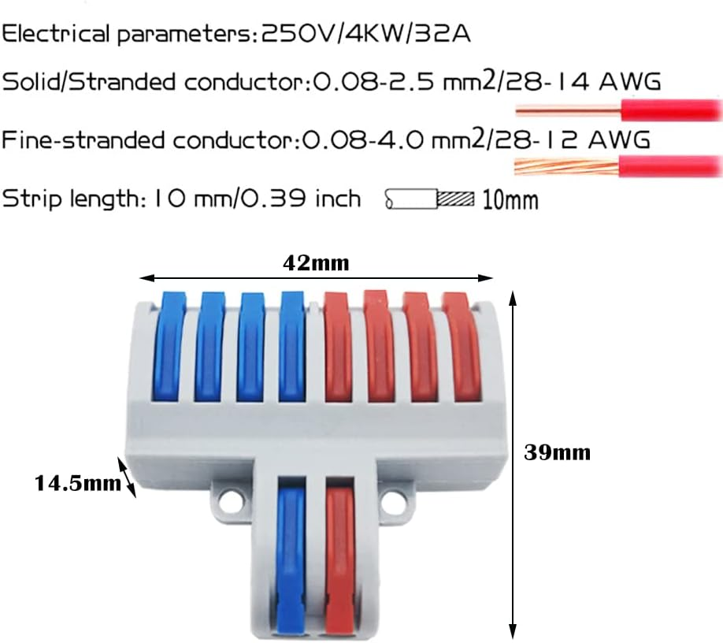
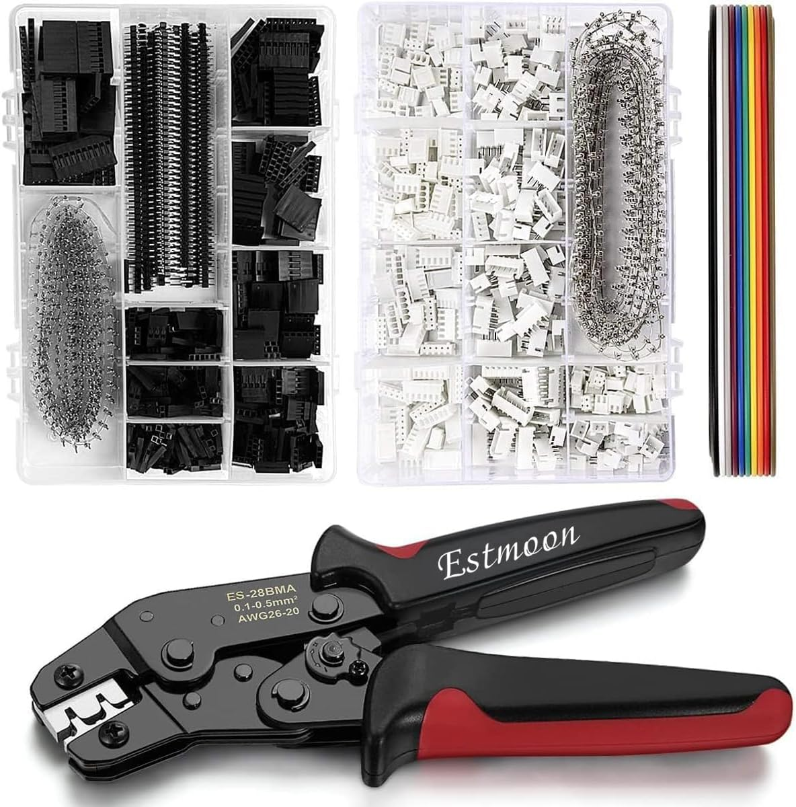
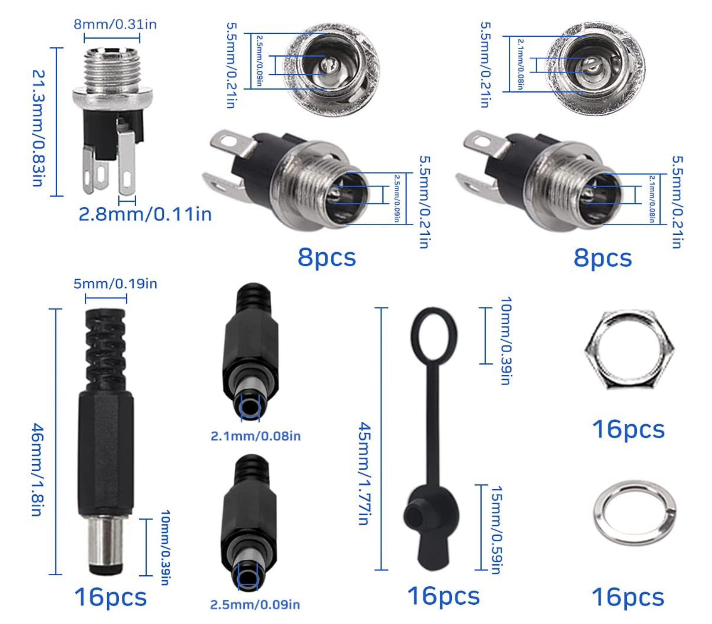

# Wiring of the electronics
We need to take into account which cable dimensions we use for different loads - 
most importantly here is the 100W grow light that we will use. 

## Cable dimensions
`0,75 mm² (18 AWG)` is enough for 12A which which is enough for all the lights (100W/24V=4,16A).
I use [this](https://www.amazon.de/dp/B0C7ZW6SPN?ref=ppx_yo2ov_dt_b_product_details&th=1) set for wiring - features 3 colors and that's enough.

## Recommended connection terminals
- Split L, N and PE wires: [3 in, 6 out](https://www.amazon.de/gp/product/B09MCM6T3Z/ref=ppx_yo_dt_b_search_asin_title?ie=UTF8&psc=1)

- Connect anything up to 3 wires: [3 in, 3 out](https://www.amazon.de/gp/product/B09MCMJBF2/ref=ppx_yo_dt_b_search_asin_title?ie=UTF8&psc=1)
  
- Distribute 24V/5V with GND: [2 in, 8 out](https://www.amazon.de/gp/product/B09MCL8498/ref=ppx_yo_dt_b_search_asin_title?ie=UTF8&psc=1)
  
- Distribute 5V/GND: [1 in, 5 out](https://www.amazon.de/gp/product/B0BF9411SV/ref=ppx_yo_dt_b_search_asin_title?ie=UTF8&psc=1)
  
- 230VAC in: [Power plug terminal](https://www.amazon.de/gp/product/B074PS1L3V/ref=ppx_yo_dt_b_search_asin_title?ie=UTF8&th=1)

# JST/Dupont connectors
For the sensors and other devices that require 5V we will use JST/Dupont connectors. This [box](https://www.amazon.de/gp/product/B07ZKDTY4V/ref=ppx_yo_dt_b_search_asin_title?ie=UTF8&psc=1) should be enough for the beginning.
Also consider getting a few meters of [ribbon cable](https://www.amazon.de/dp/B09R42ZGQD?psc=1&ref=ppx_yo2ov_dt_b_product_details) to connect all the low voltage peripherals.

# DC sockets (5.5mm x 2.1mm)
To connect the lights and the ventilation we will use [DC sockets](https://www.amazon.de/dp/B09WY3GPD4?psc=1&ref=ppx_yo2ov_dt_b_product_details) that are connected to the relais
