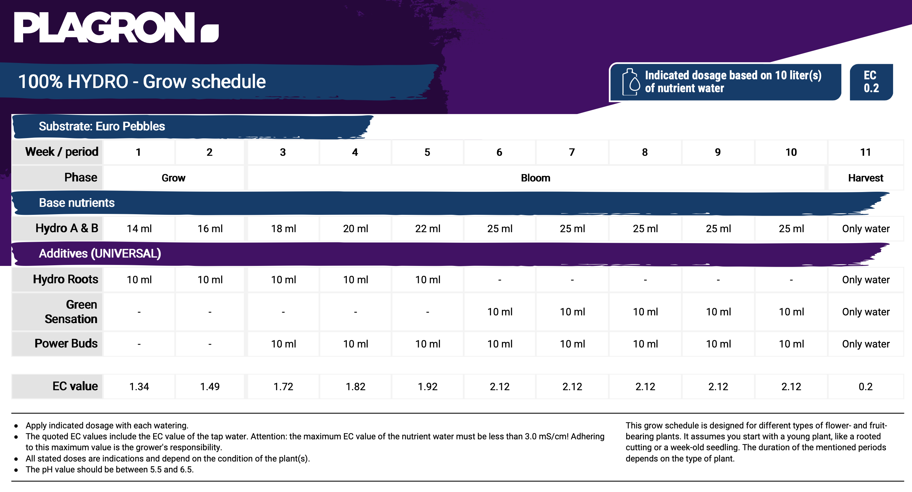

# Base Nutrients
I'm using the plagron <a href="https://plagron.com/en/hobby/products/hydro-a-hydro-b" target="_blank">Hydro A+B</a> for my nutrient solution according to following grow schedule (if longer vegetative phase wanted, just repeat week 2)
