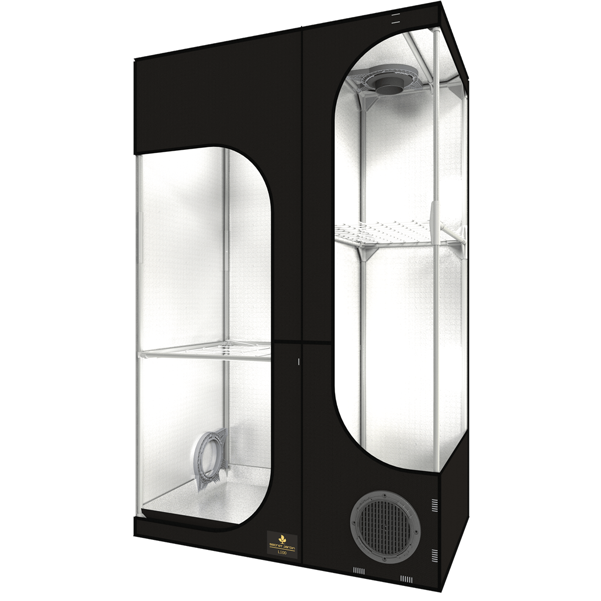

# Lodge 100
I'm using the (unfortunately discontinued) [Secret Jardin Lodge 100](`https://www.secretjardin.com/wp-content/uploads/2022/11/202210-LODGE-INSTRUCTION-Web.pdf`) as my growing tent. 
 It's a 100x60x160cm tent divided into 3 sections:

- 60x60cm for the main area. This area is completely separated from the stacked 60x40cm areas so you can use a different light schedule there (e.g. 12/12 for flowering)
- 60x40cm for the mother plant(s) or auto-flowering plant(s)
- 60x40cm for the clones (above the mother plant)

<figure>
    
    <figcaption>Lodge 100 <b>LEFT</b> side: 60x60 main area <b>RIGHT</b> side: 60x40 stacked areas</figcaption>
</figure>

## My currently used configuration
These are the components I use for my current hydro/aero setup:

### DWC Setup for Mother plant (bottom right)
[Growrilla DWC Hydro 19l](https://www.led-grower.eu/dwc-single-pot-19l/). Used with an airstone powered by an [Neptune Hydroponics air pump](https://www.led-grower.eu/vzduchovaci-pumpa-neptune-hydroponics/?variantId=28182).

### Aeroponic Cloner for Cutlings (top right)
[Nutriculture X-Stream Plant Aeroponic Unheated Propagator](https://www.led-grower.eu/aeroponicka-rizkovnice-nutriculture-x-stream/?variantId=18559)

### Aeroponic 4 plant setup for Clones (left)
[Platinum Aero Star 40x40](https://www.led-grower.eu/platinium-aero-star-40x40/) with upgraded Pump ([QWORK® Mini Wasserpumpen Ultraleise Tauchpumpe - 800 L/H – 15 W](https://www.amazon.de/gp/product/B0C3QRYST9/ref=ppx_yo_dt_b_search_asin_title?ie=UTF8&psc=1)) + 360° [nozzles](https://www.led-grower.eu/platinium-rotacni-tryska-360/)
