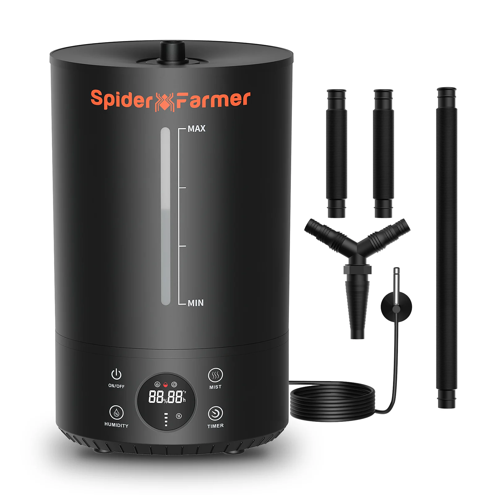

# Humidifier
Especially in the (early) vegetative stages a higher relative humidity is very necessary.
I'm using a [humidifier from Spider Farmer](https://spiderfarmer.eu/products/6l-cool-mist-humidifier/) where you can enter the desired humidity and it will turn on and off automatically.

