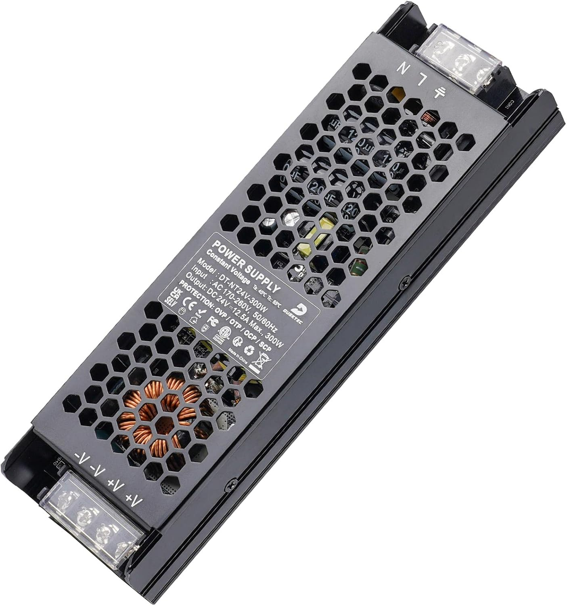

# AC-DC Converter
The converter used for 230VAC to 24VDC (to power grow LEDs + ventilation) is [this](https://www.amazon.de/dp/B09Q93S157?psc=1&ref=ppx_yo2ov_dt_b_product_details) one from DUSKTEC that has 300W which is enough for lights&co.
