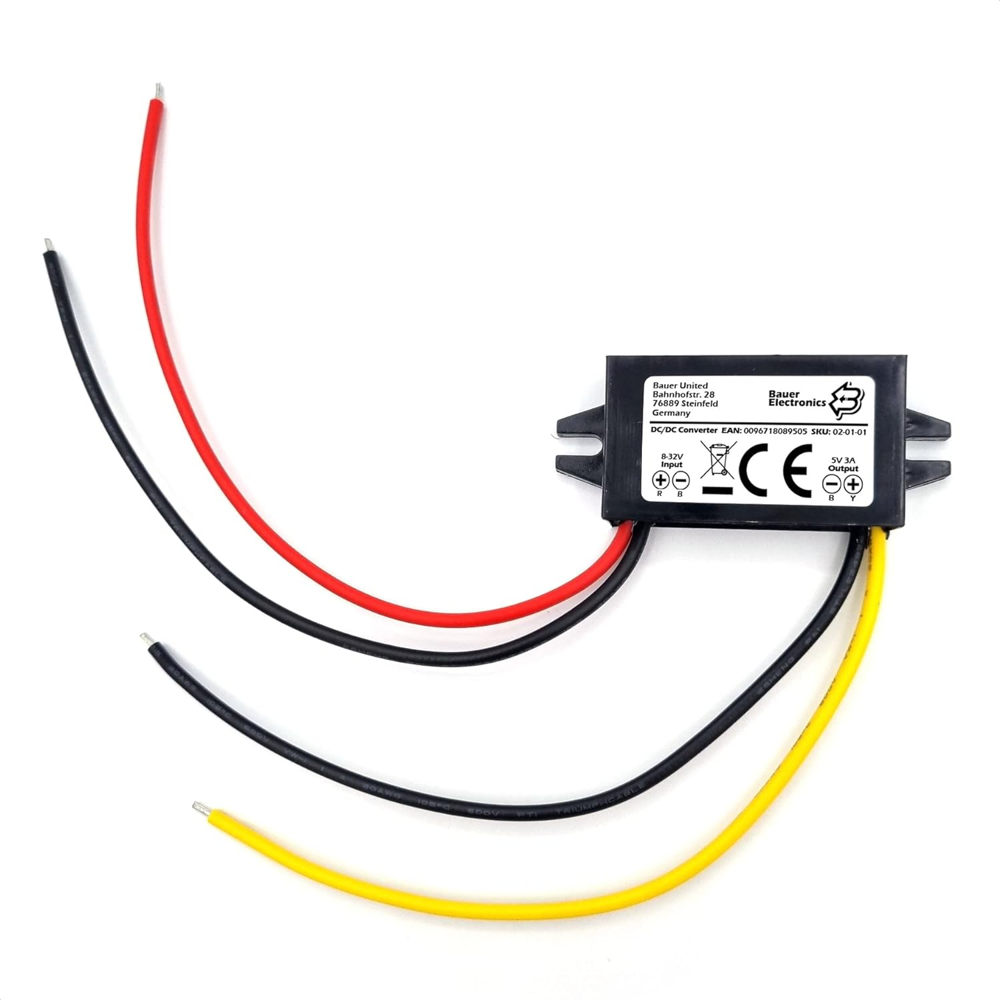

# DC-DC Converter
The ESP32 and (some) sensors require 5V to operate. 
The power supply that we have is 24V. To convert the 24V to 5V we will use a DC-DC converter. The converter that we will use is [this](https://www.amazon.de/gp/product/B09B818N5F/ref=ppx_yo_dt_b_search_asin_title?ie=UTF8&th=1) one from Bauer Electronics.
