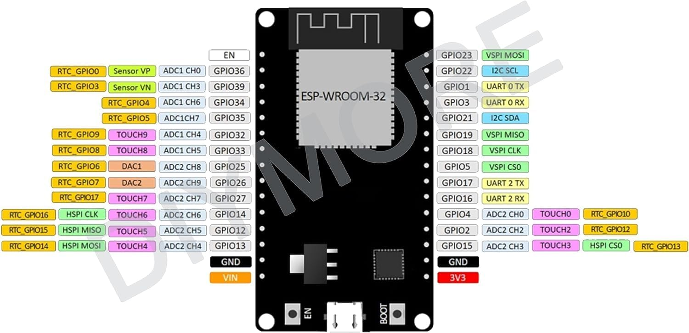

# ESP32 pinout

## My current configuration
| GPIO | Purpose    | Used for                           |
|------|------------|------------------------------------|
| 1    | None       | -                                  |
| 2    | DS18B20 #1 | 2x DS18B20 (water temp left/right) |
| 3    | None       | -                                  |
| 4    | Relay 1    | 100W LED Bloom                     |
| 5    | Relay 6    | 20W LED IR right                   |
| 9    | None       | -                                  |
| 10   | None       | -                                  |
| 12   | None       | -                                  |
| 13   | Relay 8    | 100W SF1000D                       |
| 14   | None       | -                                  |
| 15   | Relay 9    | (Un)-pluggable maintenance pumps   |
| 16   | Relay 4    | 2.85W left fans (2x Monkey Fan)    |
| 17   | Relay 5    | -                                  |
| 18   | Relay 7    | 1.5W right fan                     |
| 19   | I2C SCL #2 | BME280 right                       |
| 21   | I2C SDA #2 | BME280 right                       |
| 22   | Relay 2    | 40W IR Bloom                       |
| 23   | Relay 3    | 40W UV Bloom                       |
| 25   | Relay 10   | Main Pump                          |
| 26   | I2C SCL #1 | BME280 + MLX90614 left             |
| 27   | I2C SDA #1 | BME280 + MLX90614 left             |
| 32   | None       | -                                  |
| 33   | None       | -                                  |
| 34   | None       | -                                  |
| 35   | None       | -                                  |
| 36   | None       | -                                  |
| 39   | None       | -                                  |
