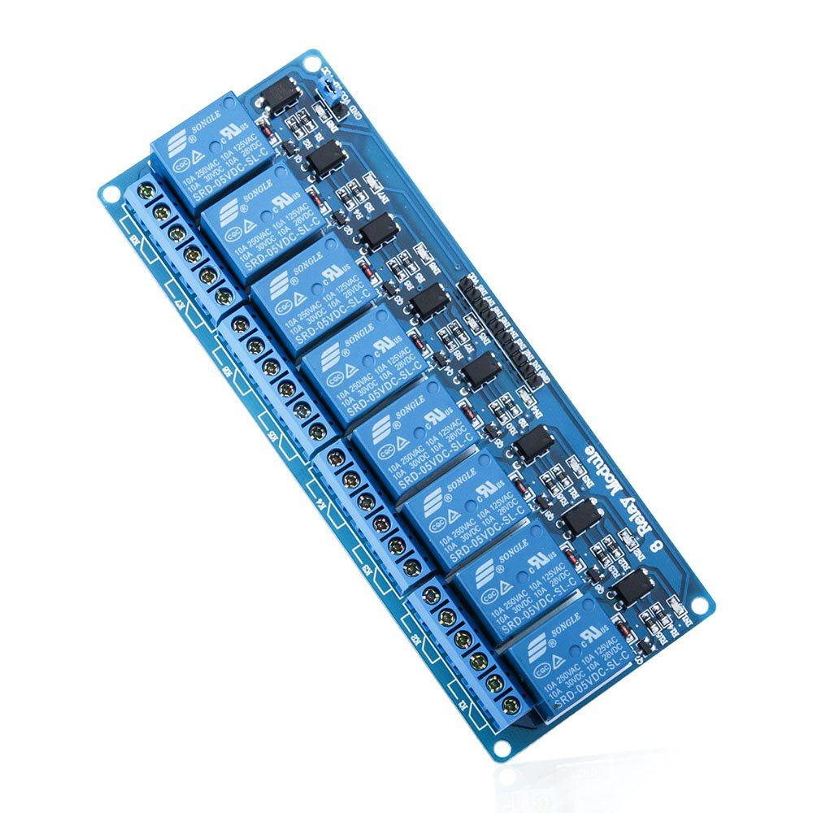

# Relais and Switches
Can be used for various grow LEDs, fans, pumps, extractors, etc… (also suitable for 230VAC). I use [this](https://www.elegoo.com/blogs/arduino-projects/elegoo-dc-5v-relay-module-tutorial) one from Elegoo  one here with 8 channels.

Additionally I got some snubbers ([link here](https://www.amazon.de/gp/product/B0B42RQPPR/ref=ppx_yo_dt_b_search_asin_title?ie=UTF8&psc=1)) to eliminate high voltage spikes caused by switching on inductive loads (currently the 2 pumps)