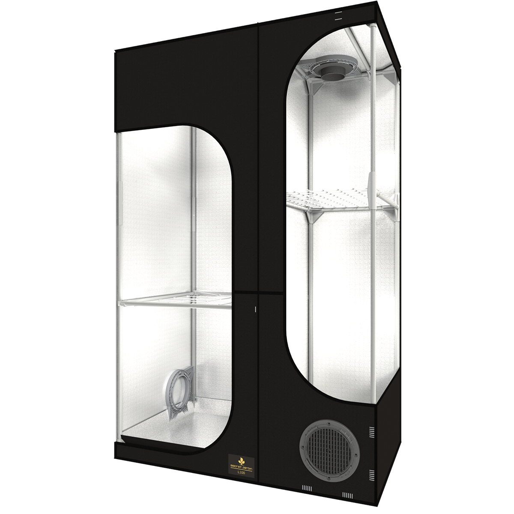

# Hello fellow grower! 🌱
This is the documentation for my own 3 area growbox project using [this](https://www.growlocation.de/secret-jardin-lodge-100x60x158-cm) grow tent which unfortunately is discontinued.
The controlling of all actors (lights, fans, pumps) and the monitoring via sensors (temperature, humidity, pH, etc.) is done by an ESP32 microcontroller running [Tasmota](https://www.tasmota.info/).

<figure>
    
    <figcaption>Lodge 100 (100cm x 60cm x 160cm) <b>LEFT</b> side: 60cm x 60cm main area <b>RIGHT</b> side: 60cm x 40cm stacked areas</figcaption>
</figure>

[//]: # (## Commands)

[//]: # ()
[//]: # (* `docker compose up -d` - Serve the project.)

[//]: # (* `docker run --rm -it -v ${PWD}:/docs squidfunk/mkdocs-material build` - Build the docs.)

[//]: # (* `docker run --rm -it -v ~/.ssh:/root/.ssh:ro -v ~/.ssh/config.docker:/root/.ssh/config:ro -v ${PWD}:/docs squidfunk/mkdocs-material gh-deploy` - deploy docs to github pages)

[//]: # (## Project layout)

[//]: # ()
[//]: # (    mkdocs.yml    # The configuration file.)

[//]: # (    docs/)

[//]: # (        index.md  # The documentation homepage.)

[//]: # (        ...       # Other markdown pages, images and other files.)

# Components
## Always on
- 2x extractors + filter (24VDC)
- humidifier with target humidity (for left/right area) (230VAC)
- air stone pump for mother plant (240VAC)

## Actors
- 3 main grow lights (24VDC / 230VAC)
- Infrared supplement for main and mother plant area (24VDC)
- UV supplement for main area (24VDC)
- fans for ventilation - 2 in the main area and 1 for the mother plant (24VDC)
- pumps for main and cloner area (230VAC)
- Atlas Scientific dosing pump for pH regulation (24V, I²C)
## Sensors
- BME280 for main and mother plant area (temperature, humidity, pressure) - I²C
- DS18B20 for each of the 3 water temperatures (main, mother plant, cloner) - analog
- MLX90614 for leaf surface temperature (for leaf VPD calculation) - I²C
- Atlas Scientific pH sensor - I²C
- Atlas Scientific EC sensor - I²C