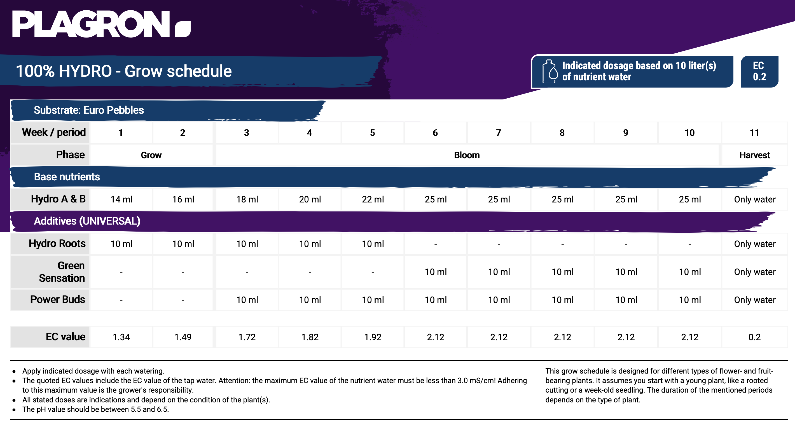

# Base Nutrients
I'm using the plagron [Hydro A+B](https://plagron.com/en/hobby/products/hydro-a-hydro-b) for my nutrient solution according to following grow schedule (if longer vegetative phase wanted, just repeat week 2)
