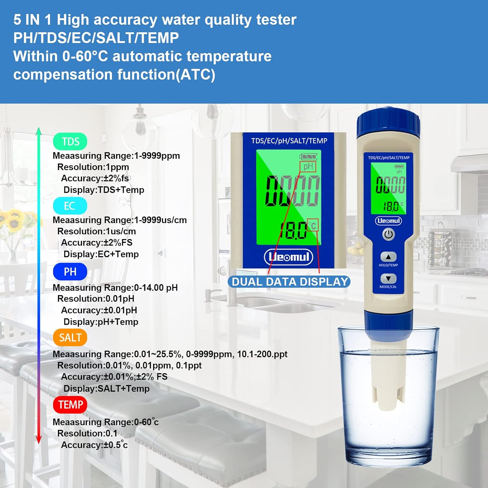

# pH/EC measurement
If you choose to grow with (DWC) hydroponics or aeroponics you need to monitor your pH and EC levels. This is crucial for the health of your plants. The pH level of your nutrient solution determines how well your plants can absorb nutrients. The EC level of your nutrient solution determines how much nutrients are available to your plants.

If you want to get started right away I can recommend you this [Multiparameter Tester from Ueomul](https://www.amazon.de/dp/B09VYW337G?ref=ppx_yo2ov_dt_b_product_details&th=1).
